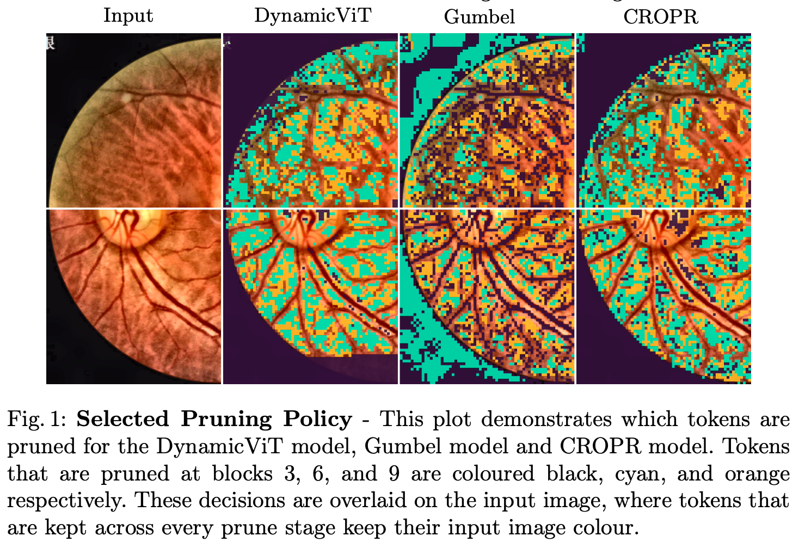
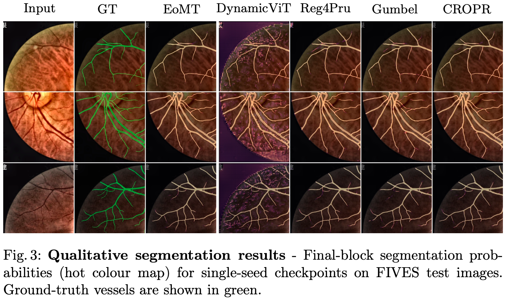

# How Do Train-Time Pruning Dynamics and Pruning Schedules Affect Retinal Vessel Segmentation?

Julian Wyatt, Irina Voiculescu — Department of Computer Science, University of Oxford

Accepted at **EMA4MICCAI 2026** (Efficient Medical AI), a MICCAI 2026 workshop.

## Abstract

Vision Transformers (ViTs) have become a prevalent architecture in modern computer vision
due to their strong scaling with foundation models and generalisability under
self-supervised learning. However, with their strong expressivity comes quadratic
computational complexity with respect to the number of tokens. Many methods seek to reduce
the total token count to improve efficiency while maintaining quantitative performance for
downstream tasks. Although token pruning has demonstrated promising efficiency gains, its
application to dense segmentation remains comparatively under-explored due to its
additional challenges. Therefore, we propose a controlled empirical study that isolates the
challenging design choices over the FIVES retinal blood vessel segmentation dataset. We
find that exposing models to *any* train-time pruning substantially improves segmentation
performance relative to soft-masking approaches. Furthermore, increasing the frequency of
pruning improves segmentation quality, but yields diminishing efficiency improvements due
to additional pruning overhead.

## Results

Figure 1 shows the learned pruning policy, while Figure 3 shows qualitative vessel
segmentation results across pruning schedules.





The tables behind the paper's numbers are in [`results/`](results/): `qA_core.csv`
(Table 1), `qBC_cropr_vits.csv` (Table 3), `qA_keep_sweep.csv` (Figure 2) and
`throughput.csv` (throughput and GFLOPs). `results/graph_data/` holds the figure-ready
series, regenerated with `python scripts/build_throughput_curves.py`.

## Setup

```bash
pip install torch torchvision timm transformers omegaconf hydra-core albumentations wandb tensorboard
```

Download [FIVES](https://figshare.com/articles/figure/FIVES_A_Fundus_Image_Dataset_for_AI-based_Vessel_Segmentation/19688169).
The study splits each 2048×2048 fundus image into four 1024×1024 quadrants and repartitions
them 70:20:10 into train/val/test. Arrange the result as an mmsegmentation-style tree and
point `DATASET.ROOT_DIR` in `configs/experiments/FIVES/dataset.yaml` at it:

```
ROOT_DIR/
  img_dir/{train,val,test}/*.png
  ann_dir/{train,val,test}/*.png   # 0 = background, 1 = vessel
```

## Running

Every experiment is a Hydra config under `configs/experiments/FIVES/study/`:

```bash
PYTHONPATH=src python src/core/train_test.py \
  config_path=experiments/FIVES/study/question_A/core/aux_route_penultimate
```

The paper's method names map onto `question_A/core/` as follows. All arms share the ViT-S
DINOv3 EoMT decoder and a 70% per-stage geometric keep rate at blocks {3, 6, 9}, differing
only in train-time pruning behaviour:

| Paper (Table 1) | Config |
|---|---|
| EoMT (no pruning) | `dense` |
| DynamicViT — soft attention masking + budget loss | `soft_mask` |
| Gumbel Pruning — hard top-*k* from the Gumbel-Softmax | `gumbel_route_penultimate` |
| Reg4Pru — train-only random token routing | `random_route` |
| Random (eval-only) — Reg4Pru weights, random eval-time selection | `random_eval` |
| CROPR — learned-query scorer + direct-BCE supervision | `aux_route_penultimate` |

The remaining config groups cover the other experiments:

| Config group | What it varies |
|---|---|
| `question_A/core/*_qstart`, `*_mask_pred` | Reinjection point (`q_start` / `mask_pred` / `penultimate`) |
| `question_A/keep_sweep/` | Keep rate 0.5→0.9 for the Gumbel and soft-mask arms (Figure 2) |
| `question_BC/cropr_vits/jump1_r0*` | 1-stage schedule, ρ = 0.2→0.9 |
| `question_BC/cropr_vits/step3_r0*` | 3-stage geometric schedule, ρ = 0.5→0.9 |
| `question_BC/cropr_vits/per_block_t*` | Per-block schedule, 256→384 tokens pruned per block |

Override any key from the CLI, e.g. `++TRAIN.EPOCHS=75 ++MODEL.EOMT_KEEP_RATES=[0.5,0.5,0.5]`.
Multi-GPU runs go through `entrypoints/train_dist.sh NUM_GPUS CONFIG DESC`; the paper trains
on 2 GPUs at per-GPU batch size 2 with 2 gradient-accumulation steps.

Throughput and GFLOPs are measured separately, on one GPU:

```bash
python scripts/measure_throughput.py \
  --config-dir configs/experiments/FIVES/study/question_BC/cropr_vits \
  --batch-sizes 8 --repeats 3
```

The qualitative script reconstructs Figure 3 probability maps and the Figure 1 selected-pruning
policy (black/cyan/orange mark first pruning at blocks 3/6/9) from trained checkpoints:

```bash
PYTHONPATH=src python scripts/make_qualitative_figures.py --rows 3
```

## Layout

```
configs/       Hydra configs; FIVES/study/ holds the paper experiments
src/core/      Config schema (conf.py) and entry point (train_test.py)
src/models/    EoMT, the pruning model (EoMT_pruning.py), and the CROPR scorer
src/trainer/   Manual-DDP trainer, Mask2Former loss, eval metrics, throughput
scripts/       Measure throughput and rebuild the result tables
results/       Result tables behind the paper's tables and figures
```

## Acknowledgements

Built on [EoMT](https://github.com/tue-mps/eomt) (MIT) with the cross-attention token
scorer ported from [CROPR](https://github.com/benbergner/cropr) and the routing module
from [TREAD](https://github.com/CompVis/tread). Backbones come from
[timm](https://github.com/huggingface/pytorch-image-models).

This repository contains code that was substantially generated with the assistance of an LLM-based coding agent, with human review and editing. The authors are responsible for the final code, results, and claims.

This work was supported by the Engineering and Physical Sciences Research Council
[grant number CS2324_EPSRC_1631720], and used the University of Oxford Advanced Research
Computing (ARC) facility ([doi:10.5281/zenodo.22558](https://doi.org/10.5281/zenodo.22558)).

## Citation

<!-- TODO: update pages/DOI once the proceedings are published. -->

```bibtex
@InProceedings{WyaJul_How_MICCAISAT2026,
        author = { Wyatt, Julian AND Voiculescu, Irina},
        title = { { How Do Train-Time Pruning Dynamics and Pruning Schedules Affect Retinal Vessel Segmentation? } },
        booktitle = {Medical Image Computing and Computer Assisted Intervention -- MICCAI 2026 Workshops and Challenges},
        year = {2026},
        publisher = {Springer Nature Switzerland},
        volume = {LNCS 17265},
        month = {pending},
        page = {pending}
}

```
